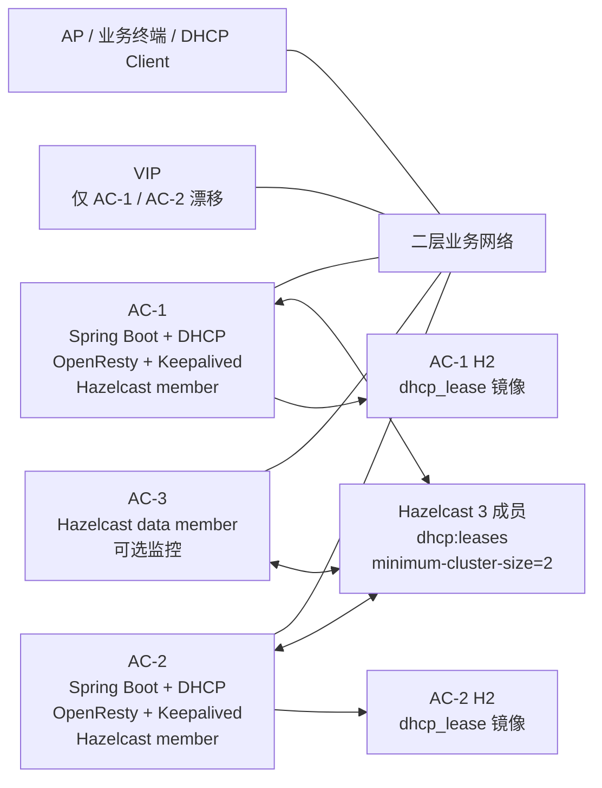

# AC 三节点 HA 与 DHCP 热备概要设计

## 1. 设计结论

推荐采用“两台业务热备 + 一台仲裁见证”的三节点架构。AC-1 与 AC-2 承载业务、VIP、HTTP/API 与 DHCP；AC-3 作为 Hazelcast 数据成员和多数派仲裁节点，不承载 VIP 和 DHCP。

DHCP 必须保持单主热备，不能让多个节点同时对同一地址池分配地址。租约必须先进入三节点多数派保护的共享状态，再返回给客户端。

## 2. 推荐架构



角色分工：

| 能力 | AC-1 | AC-2 | AC-3 |
|---|---:|---:|---:|
| HTTP/API 入口 | 是 | 是 | 否 |
| VIP 漂移 | 是 | 是 | 否 |
| DHCP 监听 | 是 | 是 | 否 |
| DHCP 响应 | 仅 MASTER | 仅 MASTER | 否 |
| Hazelcast 成员 | 是 | 是 | 是 |
| 租约权威状态 | `dhcp:leases` | `dhcp:leases` | `dhcp:leases` |
| H2 本地镜像 | 是 | 是 | 可选 |
| 仲裁投票 | 是 | 是 | 是 |

## 3. 组件职责

| 组件 | 职责 |
|---|---|
| Keepalived | 负责 VIP 漂移、VRRP 选主、健康检查和状态通知。 |
| VIP | 对 AP/业务终端、浏览器和上层系统暴露统一访问地址。 |
| OpenResty | 只代理 HTTP/API 到本机 Spring Boot，不代理 DHCP。 |
| Spring Boot | 承载 AC 业务、HA 角色判断、DHCP 服务和对外副作用控制。 |
| Hazelcast | 提供三节点成员关系、租约共享状态和多数派保护。 |
| H2 | 保存业务节点本地租约镜像，用于重启恢复和本地查询。 |
| AC-3 | 作为仲裁/见证节点参与多数派，不直接响应 DHCP。 |

## 4. HTTP/API 高可用入口

HTTP/API 统一通过 VIP 访问。AC-1 与 AC-2 本机各部署一份 OpenResty，但只有持有 VIP 的节点实际接收入口流量。


第一版 OpenResty 配置保持最小化：监听 HTTP 端口，反向代理到本机 Spring Boot，透传客户端地址与 Host 信息。不要让 OpenResty 承担跨节点负载均衡，因为当前方案是主备，不是 HTTP 多活。

## 5. DHCP 高可用原则

- DHCP 只有当前 MASTER 可以响应。
- STANDBY 可以监听、同步和准备接管，但不能发送 `DHCPOFFER`、`DHCPACK` 或控制类网络包。
- DHCP Option 54 Server Identifier 必须使用 VIP。
- 分配新租约前必须确认 Hazelcast 有多数派。
- 租约状态以 Hazelcast `dhcp:leases` 为运行时权威，以 H2 `dhcp_lease` 为本地镜像。
- 节点角色未知、VIP 未绑定本机、Hazelcast 不可用或租约视图不可信时，拒绝新分配。

## 6. 方案对比

| 方案 | 描述 | 防重复 IP | 轻量性 | 可恢复性 | 实现复杂度 | 结论 |
|---|---|---:|---:|---:|---:|---|
| 推荐方案 | 2 业务节点 + 1 仲裁节点，DHCP 单主，Hazelcast 多数派保护 | 高 | 中 | 高 | 中 | 推荐 |
| 双机主备 | Keepalived + VIP + 单主 DHCP + Hazelcast/H2 | 中 | 高 | 中 | 中 | 可作为退化方案 |
| 三机全业务接管 | 3 台都部署完整 AC，三节点 VRRP，仍保持 DHCP 单主 | 高 | 中 | 高 | 高 | 现场要求第三台接管时采用 |
| Active-Active DHCP | 多节点同时分配，拆分地址池或做冲突协调 | 中 | 中 | 中 | 高 | 不适合第一阶段 |
| 中心数据库方案 | 引入 PostgreSQL、Redis 或 etcd 做中心状态 | 高 | 低 | 高 | 高 | 后续可选 |

## 7. 增强架构

如果现场要求 AC-3 也能在 AC-1、AC-2 故障后直接接管业务，可把 AC-3 部署成完整业务节点：

```text
AC-1 priority 110
AC-2 priority 100
AC-3 priority 90
```

三台 Keepalived 配置同一个 `virtual_router_id` 和同一个 VIP，`unicast_peer` 包含另外两台机器。同一时刻仍只允许一个 MASTER 响应 DHCP。

该方案提升业务接管能力，但改造和运维复杂度更高。第一阶段仍建议 AC-3 只作为 Hazelcast 数据成员和仲裁见证节点。

## 8. 故障行为

| 场景 | 期望行为 |
|---|---|
| AC-1 宕机 | AC-2 与 AC-3 形成多数派，AC-2 接管 VIP 和 DHCP。 |
| AC-2 宕机 | AC-1 与 AC-3 保持多数派，AC-1 继续服务。 |
| AC-3 宕机 | AC-1 与 AC-2 仍有 2 个成员，继续服务，但应告警。 |
| AC-1 与 AC-2 网络不通，AC-3 在 AC-2 侧 | AC-2 侧有多数派，AC-1 侧禁止 DHCP。 |
| AC-1 单独成孤岛但仍持有 VIP | HA 健康失败，释放 VIP；即使未释放，也不能响应 DHCP。 |
| Hazelcast 少于 2 成员 | 禁止新分配，第一版不建议开放本地续租例外。 |
| 旧主恢复 | 先作为 STANDBY 同步租约，不抢占；同步完成后再具备接管资格。 |

## 9. 标准方案参考

主流 DHCP HA 和网络 HA 思路与本设计一致：

- Microsoft DHCP failover 的热备模式由 active 服务器负责地址分配，standby 在 active 不可用时接管。
- ISC Kea HA 的 `hot-standby` 模式下 primary 响应 DHCP，standby 接收租约更新但不响应请求。
- VRRP/Keepalived 负责 VIP 漂移和选主。
- Hazelcast split-brain protection 可在成员数低于阈值时拒绝受保护数据结构操作，适合保护 DHCP 租约 Map。

参考链接：

- [Microsoft DHCP failover](https://learn.microsoft.com/en-us/windows-server/networking/technologies/dhcp/dhcp-failover)
- [ISC Kea High Availability hook](https://kea.readthedocs.io/en/stable/arm/hooks.html)
- [VRRP RFC 5798](https://www.rfc-editor.org/rfc/rfc5798.html)
- [Keepalived manpage](https://www.keepalived.org/manpage.html)
- [Hazelcast split-brain protection](https://docs.hazelcast.com/hazelcast/5.6/network-partitioning/split-brain-protection)
