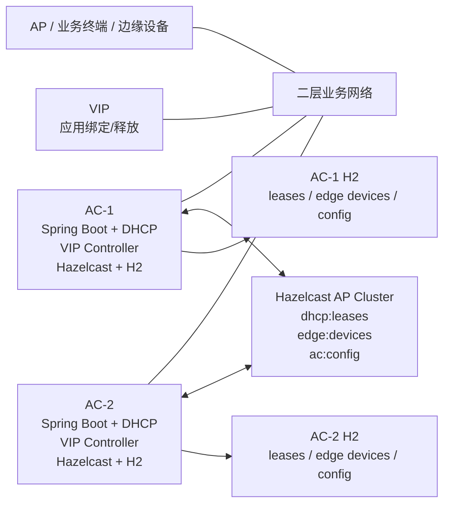

# AC 两节点 AP 优先高可用概要设计

## 1. 设计结论

采用“两台业务 AC + 应用自控 VIP + Hazelcast AP 同步 + H2 本地镜像”的轻量方案。谁实际持有 VIP，谁就是当前主节点；不维护额外运行时角色，不引入仲裁节点，不把 Keepalived 作为正式依赖。

网络分区时，单侧只看到自己即可获取 VIP 并继续服务。网络恢复后，系统先收敛 VIP，再由当前 VIP 持有节点生成 DHCP 租约、边缘设备和 AC 配置的最终视图。

## 2. 架构



## 3. 组件职责

| 组件 | 职责 |
|---|---|
| Spring Boot | 承载 DHCP、HTTP/API、VIP 状态判定、配置持久化和恢复合并。 |
| VIP Controller | 在 Ubuntu 上检查、绑定、释放 VIP，并在绑定后发送 gratuitous ARP。 |
| Hazelcast | 提供双节点成员可见性和三类在线 Map 同步。 |
| H2 | 保存本节点 DHCP 租约、边缘设备、AC 配置的本地持久化镜像。 |
| OpenResty/Nginx | 可选本机反向代理，只代理到本机 Spring Boot，不参与 HA。 |

## 4. 主备与服务闸门

```yaml
ha:
  ip:
  interface-name:
  prefix-length: 24
  vip-management-enabled: true
  command-timeout-seconds: 3
```

- `ha.ip` 已配置时使用该 IP 作为 VIP。
- `ha.ip` 未配置时，从 Ubuntu 第一块物理网卡获取 IPv4 作为 VIP。
- `ha.prefix-length` 用于应用执行 `ip address add/del <VIP>/<PREFIX>`。
- 本机实际持有 VIP 时，可以执行写入类 API、DHCP 响应和对外副作用任务。
- 本机不持有 VIP 时，只执行只读查询、状态检查、本地镜像同步和恢复覆盖。
- Hazelcast 成员数只用于判断单节点、双节点和恢复流程，不作为 DHCP 阻断条件。

## 5. 数据同步

| 数据 | 写入路径 | 恢复策略 |
|---|---|---|
| DHCP 租约 | VIP 持有节点写 H2，再写 `dhcp:leases` | 主侧租约优先，非冲突补并，冲突请求后续 DHCPNAK。 |
| 边缘设备 | VIP 持有节点写 `edge_device`，再写 `edge:devices` | SN/IP 冲突主侧优先，非冲突 SN 补并，IP 最终唯一。 |
| AC 配置 | VIP 持有节点写 `ac_config`，再写 `ac:config` | 主侧完整配置覆盖非主侧，不做字段级合并。 |

## 6. 对外接口

```text
GET /internal/ha/status
GET /internal/ac/config
PUT /internal/ac/config
GET /internal/edge-devices
GET /internal/edge-devices/{sn}
PUT /internal/edge-devices/{sn}
```

`PUT /internal/ac/config` 和 `PUT /internal/edge-devices/{sn}` 仅允许当前 VIP 持有节点执行。分区期间两侧如果各自持有 VIP，则各自可在本分区内写入；恢复后按主侧优先收敛。
