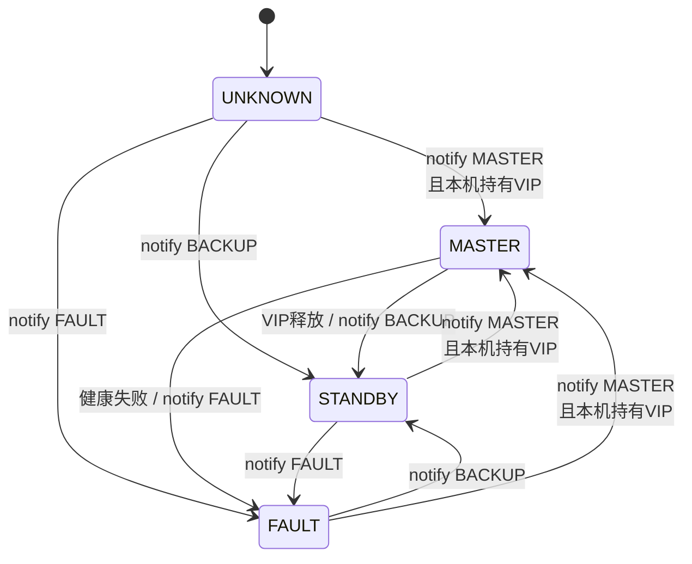
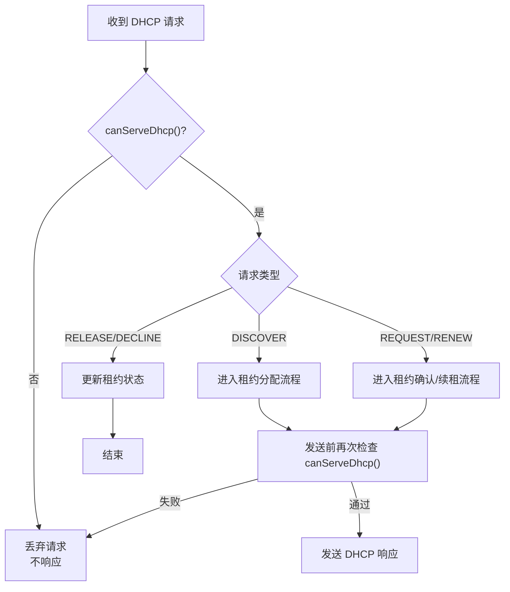

# AC 高可用与 DHCP 热备详细设计

## 1. HA 角色模型

Spring Boot 内部维护应用级 HA 角色。角色不能只依赖 Keepalived 通知，还必须结合本机是否实际持有 VIP、Hazelcast 是否有多数派、租约状态是否可信来判断。

角色枚举：

```text
UNKNOWN
MASTER
STANDBY
WITNESS
FAULT
MAINTENANCE
```

角色含义：

| 角色 | 含义 |
|---|---|
| `UNKNOWN` | 节点刚启动或状态未确认，不允许对外副作用。 |
| `MASTER` | 当前业务主节点，满足条件时允许响应 DHCP 和执行对外任务。 |
| `STANDBY` | 业务备节点，可同步租约和健康状态，不响应 DHCP。 |
| `WITNESS` | 仲裁见证节点，参与 Hazelcast 多数派，不承载业务。 |
| `FAULT` | 节点异常，不允许提供服务。 |
| `MAINTENANCE` | 运维维护状态，不主动接管业务。 |

建议提供接口：

```text
POST /internal/ha/role?role=MASTER|BACKUP|FAULT
GET  /actuator/health/ha
GET  /internal/ha/status
```

`BACKUP` 是 Keepalived 通知里的状态名称，应用内部可统一映射为 `STANDBY`。

## 2. `canServeDhcp()` 判定

应用判断是否能服务 DHCP 时必须同时满足：

```text
本机角色是 MASTER
本机实际持有 VIP
Hazelcast 集群有多数派
dhcp:leases 可读写
本地租约镜像已加载完成
DHCP 没被人工禁用
节点不处于 FAULT 或 MAINTENANCE
```

任何条件不满足，节点都不能发送 DHCP 响应。该判断应在 DHCP 处理链路前后各执行一次，避免处理过程中角色变化后旧主继续发包。

## 3. Keepalived 与 VIP 接管

Keepalived 负责 VIP 漂移、健康检查和状态通知。Spring Boot 负责根据通知更新应用角色，并二次校验本机是否真的持有 VIP。



最小脚本与配置：

| 文件 | 职责 |
|---|---|
| `deploy/keepalived/keepalived.conf` | 配置 VIP、网卡、优先级、VRRP、健康检查和通知脚本。 |
| `deploy/keepalived/notify.sh` | 调用 `POST /internal/ha/role?role=...` 通知应用角色变化。 |
| `deploy/keepalived/check_app.sh` | 调用 `GET /actuator/health/ha`，决定 Keepalived 是否应持有 VIP。 |
| `deploy/openresty/nginx.conf` | 将 VIP HTTP/API 入口代理到本机 Spring Boot。 |

健康检查不能只看 Spring Boot 进程是否存活，还要覆盖 HA 状态、DHCP 可用性、Hazelcast 多数派和租约镜像加载状态。

## 4. DHCP 响应闸门

两台业务 AC 都可能收到 DHCP 广播，因此 DHCP 模块必须由 HA 角色控制。只有 `canServeDhcp()` 为 `true` 的节点可以发送响应。



需要覆盖的 DHCP 行为：

- `DHCPOFFER`
- `DHCPACK`
- `DHCPNAK`
- `DHCPRELEASE`
- `DHCPDECLINE`
- 续租和重新绑定流程

## 5. DHCP Server Identifier

DHCP Option 54 Server Identifier 必须使用 VIP。否则客户端续租可能直接找旧主物理 IP，主备切换后出现续租失败、绕过新主或双主混乱。

配置规则：

```text
优先使用配置项 dhcp.server-identifier
生产 HA 环境配置为 VIP
单机环境可配置为本机业务 IP
```

发送 DHCP 响应时应尽量绑定 VIP 作为源地址。绑定失败时，应用必须确认当前是否真的持有 VIP；不能在 STANDBY 上继续发送。

## 6. 租约权威状态

当前 `ConcurrentHashMap` 只能作为本地缓存，不能作为 HA 场景下的权威状态。第一版应将 Hazelcast `dhcp:leases` 作为运行时权威租约状态，将 H2 `dhcp_lease` 作为本地持久化镜像。

建议新增核心对象：

```text
DhcpLeaseService
DhcpLeaseRepository
DhcpLeaseEntity
HazelcastDhcpLeaseStore
```

Hazelcast 建议：

```text
dhcp:leases
  backup-count = 2
  split-brain-protection-ref = dhcp-majority

dhcp:lease-locks 或按 IP key 原子执行
  split-brain-protection-ref = dhcp-majority

dhcp-majority
  minimum-cluster-size = 2
```

租约分配流程：

```text
1. 根据 MAC / deviceId 查询已有租约
2. 没有租约时选择候选 IP
3. 对候选 IP 做 Hazelcast 原子占用
4. 占用成功后写本地 H2 镜像
5. 确认仍是 MASTER 且持有 VIP
6. 发送 DHCP 响应
```

## 7. H2 本地镜像

新增表 `dhcp_lease`：

| 字段 | 说明 |
|---|---|
| `id` | 主键。 |
| `ip_address` | 租约 IP，唯一。 |
| `mac_address` | 设备 MAC，按业务规则唯一。 |
| `device_id` | 设备标识，可为空或后续增强。 |
| `lease_state` | `OFFERED` / `ACTIVE` / `EXPIRED` / `RELEASED` / `DECLINED`。 |
| `lease_start_time` | 租约开始时间。 |
| `lease_expire_time` | 租约过期时间。 |
| `last_seen_time` | 设备最近出现时间。 |
| `owner_node_id` | 最后写入或维护该租约的 AC 节点。 |
| `ha_epoch` | 主节点任期，用于防止旧主写入。 |
| `version` | 乐观锁版本。 |
| `created_at` / `updated_at` | 创建与更新时间。 |

最小唯一约束：

```text
unique(ip_address)
unique(mac_address)
```

如果后续需要同一 MAC 多设备或按 deviceId 绑定，应先明确业务规则再调整唯一约束。

## 8. 启动恢复

节点启动恢复流程：

```text
节点启动
  -> 读取 H2 本地租约
  -> 加入 Hazelcast
  -> 如果 Hazelcast 为空且有多数派，按版本/过期时间合并
  -> 如果 Hazelcast 已有权威视图，以 Hazelcast 覆盖本地镜像
  -> 本地镜像同步完成
  -> 节点才允许成为 VIP eligible
```

旧主恢复时必须先作为 STANDBY 同步租约，不应抢占 VIP，也不应继续响应 DHCP 或发送广播/多播。

## 9. 定时任务与广播/多播

所有对外有副作用的任务都应加同一个 HA 闸门。

只有 MASTER 执行：

- DHCP 租约过期回收。
- 设备发现广播。
- 主动控制类广播/多播。
- 对 AP/业务终端的状态写入和指令下发。
- 会影响外部设备状态的定时任务。

STANDBY 可执行：

- 接收租约同步。
- 更新本地 H2 镜像。
- 健康检查。
- 只读监控。
- 不产生外部副作用的缓存预热。

判定原则：

```text
只要 BACKUP/STANDBY 对外发送业务控制类网络包，就存在应用层双主风险。
```

## 10. 分区与异常处理

| 场景 | 处理策略 |
|---|---|
| Hazelcast 少于 2 成员 | 禁止新分配，第一版不开放本地续租例外。 |
| 本机角色未知 | 不响应 DHCP，不执行对外副作用。 |
| 本机不持有 VIP | 不响应 DHCP。 |
| 租约镜像未加载完成 | 不允许成为可接管节点。 |
| 旧主无法降级但失去多数派 | 即使仍持有 VIP，也不能响应 DHCP。 |
| AC-3 宕机 | AC-1 与 AC-2 仍有多数派，继续服务并告警。 |
| AC-1/AC-2 分区 | 只有拥有 AC-3 的一侧允许服务。 |

## 11. 第一版落地边界

第一版保留：

- HA 角色管理。
- DHCP 单主控制。
- Hazelcast `dhcp:leases`。
- H2 `dhcp_lease` 持久化镜像。
- `dhcp.server-identifier` 配置项。
- Keepalived 通知脚本和 HA 健康检查。
- 广播、多播、定时任务的 HA 闸门。

第一版暂不纳入：

- 复杂配置同步。
- 独立 HA 状态页面。
- 多网段 DHCP 适配。
- 中心数据库或 etcd。
- 完整自动化部署脚本。
