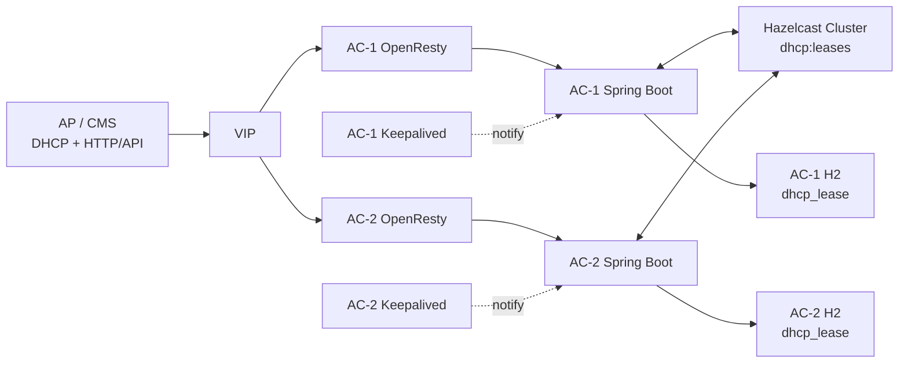
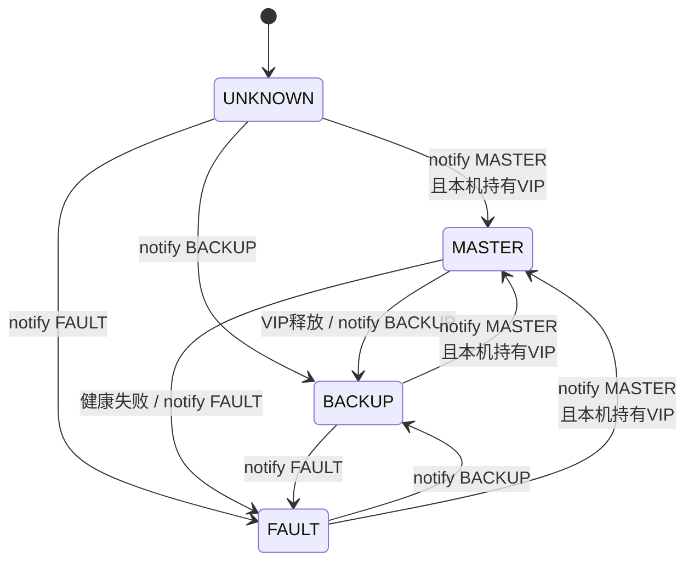
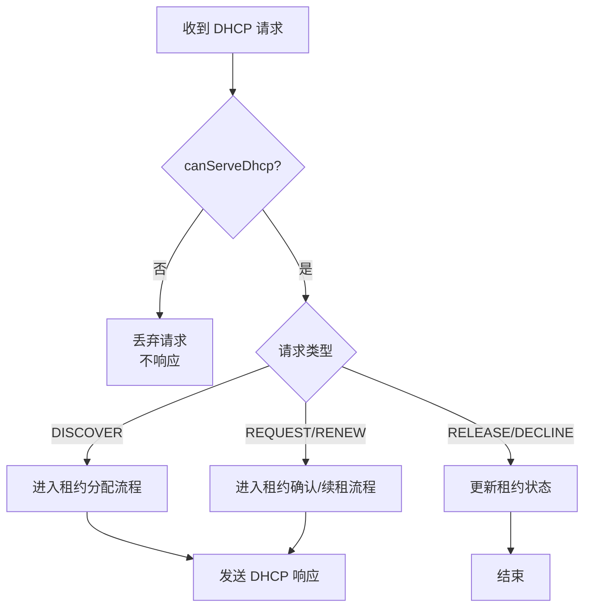
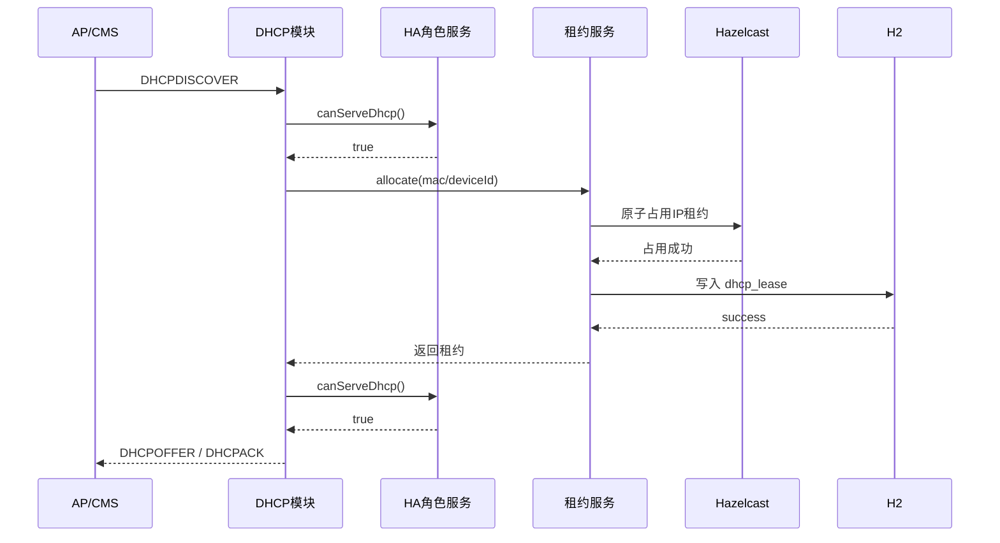

# AC 双机高可用设计总结

面向 Spring Boot 单体 AC 项目，使用 Keepalived、VIP、OpenResty、Hazelcast 与 H2 构建轻量主备高可用。

## 目录

- [1. 需求](#1-需求)
- [2. 约束](#2-约束)
- [3. 方案对比与决策](#3-方案对比与决策)
- [4. 详细设计](#4-详细设计)
- [5. 总结](#5-总结)

## 1. 需求

### 1.1 业务背景

当前系统为 AC 产品。AC 下管理多个 AP，AP 下管理多个 CMS，AP 和 CMS 都需要 IP 地址，由 AC 内置 DHCP 服务完成地址分配。
系统部署在封闭医疗内网中，医院原有设备 IP 基本固定，接入本医疗设备系统后，只需要设置 AC 的 IP、IP 池与预留 IP。

### 1.2 高可用目标

- 两台 AC 部署在同一业务网段内，形成轻量主备。
- AC 管理端 HTTP/API 通过 VIP 暴露。
- DHCP 服务随主备切换恢复工作。
- 主备切换期间允许短暂无法获取 IP，但不允许重复分配 IP。
- 尽量保持单体和轻量，不引入额外服务器。
- 优先复用当前 Spring Boot、Hazelcast、H2、Flyway、OpenResty 技术栈。

### 1.3 当前系统现状

- Spring Boot 已实现基本业务功能。
- 项目已初步引入 Hazelcast，按集群模式在两台 AC 之间通信。
- DHCP 服务由 Netty 与 Java Net 实现。
- DHCP 租约当前使用 `ConcurrentHashMap` 本地内存保存。
- 其他缓存模块主要使用 Caffeine。
- 数据库为 H2 文件模式，两台 AC 各自使用不同数据库文件。
- ORM 使用 Hibernate，引入 Spring Data JPA。
- 数据库初始化已使用 Flyway。

## 2. 约束

### 2.1 网络与部署约束

- 两台 AC、AP、CMS 都在同一个二层网段。
- AP/CMS 的 DHCP 广播能被两台 AC 同时收到。
- 没有额外交换机、路由器或独立网关服务器可用于部署 Nginx。
- OpenResty 只能部署在两台 AC 本机。
- AC 部署服务器性能一般，方案不能过重。

### 2.2 技术与数据约束

- H2 是本地文件模式，两台 AC 不是共享数据库。
- 租约当前未持久化，完全依赖本地内存。
- IP 池主要依赖手动配置范围与预留。
- DHCP 默认使用当前主机第一块物理网卡 IP 作为 Server IP。
- 当前 DHCP 服务默认随应用自动启动，除非管理界面人工停用。

> 关键约束：OpenResty 不能解决 DHCP 高可用。DHCP 是 UDP 67/68 广播协议，高可用核心在于 VIP 主备、DHCP 单主响应、租约一致性。

### 2.3 风险约束

- 两节点无第三方仲裁，无法在所有网络分区场景下同时保证强一致与高可用。
- 医疗内网场景下应优先保证不重复分配 IP。
- 当角色未知、VIP 未绑定本机、Hazelcast 不可用或租约视图不可信时，应拒绝新分配。

## 3. 方案对比与决策

### 3.1 候选方案

| 方案 | 描述 | 防重复 IP | 轻量性 | 可恢复性 | 实现复杂度 | 结论 |
|---|---|---:|---:|---:|---:|---|
| A | Keepalived + VIP + OpenResty + 单主 DHCP + Hazelcast 租约同步 + H2 镜像 | 5 | 4 | 4 | 3 | 推荐 |
| B | Keepalived + OpenResty + 单主 DHCP + 仅本地 H2 | 3 | 5 | 3 | 2 | 不建议 |
| C | 两台 DHCP Active-Active，拆分 IP 池 | 3 | 3 | 3 | 4 | 不适合当前 |
| D | 引入 PostgreSQL / Redis / etcd 做中心状态 | 5 | 2 | 5 | 4 | 偏重，后续可选 |
| E | 只使用 OpenResty 做反向代理 | 1 | 5 | 1 | 1 | 不成立 |

### 3.2 最终决策

采用方案 A：Keepalived 负责 VIP 与主备切换，OpenResty 负责 HTTP/API 入口，Spring Boot 根据 HA 角色控制 DHCP 单主响应，Hazelcast 作为运行时租约权威状态，H2 作为本地持久化镜像。

### 3.3 最小落地边界

| 类别 | 保留内容 | 暂不纳入第一版 |
|---|---|---|
| 代码 | HA 角色管理、DHCP 单主控制、Hazelcast 租约 Map、H2 租约持久化、健康检查 | 复杂配置同步、HA 状态页面、多网段适配 |
| 数据库 | 只新增 `dhcp_lease` | `ha_node_state`、租约事件表、配置版本表、IP 池表、预留 IP 表 |
| 脚本配置 | `keepalived.conf`、`notify.sh`、`check_app.sh`、`nginx.conf` | systemd 脚本、firewall 脚本、自动化验证脚本 |

## 4. 详细设计

### 4.1 总体架构



架构分工明确：VIP 负责入口漂移，OpenResty 负责 HTTP/API 代理，Spring Boot 负责业务与 DHCP，Hazelcast 负责运行时租约一致性，H2 负责本地持久化恢复。

### 4.2 HA 角色与 VIP 接管

Spring Boot 内部维护 HA 角色状态：`MASTER`、`BACKUP`、`FAULT`、`UNKNOWN`。
Keepalived 状态变化后通过通知脚本告知 Spring Boot。Spring Boot 不能只相信通知，还要校验本机是否真正持有 VIP。



| 功能点 | 是否必须 | 不加的问题 |
|---|---|---|
| Keepalived + VIP | 必须 | 没有统一入口，故障后需要人工改 IP。 |
| Spring Boot HA 角色状态 | 必须 | 应用不知道自己是否应响应 DHCP。 |
| Keepalived 通知 Spring Boot | 必须 | VIP 已切换但应用角色未切换，可能导致旧主继续响应或新主不响应。 |
| 健康检查 | 强烈必须 | Keepalived 可能把 VIP 留在 Spring Boot 或 DHCP 不可用的节点上。 |

### 4.3 HTTP/API 高可用入口

AC 所有 HTTP/API 通过 VIP 暴露。两台 AC 本机各部署一份 OpenResty，但只有持有 VIP 的节点实际接收访问。
OpenResty 只处理 HTTP/API，不代理 DHCP。


第一版 OpenResty 配置保持最小：监听 HTTP 端口，反向代理到本机 Spring Boot，透传客户端地址与 Host 信息。
不要求 OpenResty 做复杂负载均衡，因为两台 AC 是主备，不是 HTTP 多活。

### 4.4 DHCP 单主控制

因为两台 AC 都能收到 DHCP 广播，DHCP 模块必须由 HA 角色控制。只有 `MASTER` 允许发送 `DHCPOFFER` 和 `DHCPACK`。
其他状态直接丢弃请求，不响应。



DHCP Option 54 / Server Identifier 应为 VIP。如果当前配置文件里的 DHCP IP 已经用于 Option 54，只需要把该配置设置为 VIP；如果代码仍从物理网卡取值，则需要调整。

### 4.5 DHCP 租约一致性

当前 `ConcurrentHashMap` 只能保存本地内存租约，不能作为 HA 场景下的权威状态。
第一版将 Hazelcast `dhcp:leases` 作为运行时权威租约状态，H2 `dhcp_lease` 作为本地持久化镜像。



租约一致性规则：

- 先占用 Hazelcast，再写 H2，最后响应 DHCP。
- Hazelcast 不可用时，默认不分配新 IP。
- BACKUP 接管时，优先使用 Hazelcast 中的租约视图。
- 节点重启时，从 H2 恢复本地租约，再与 Hazelcast 合并。
- 过期租约回收只允许 MASTER 执行。

### 4.6 最小数据库设计

第一版只新增一张表：`dhcp_lease`。

| 字段 | 含义 |
|---|---|
| `id` | 主键 |
| `ip_address` | 租约 IP |
| `mac_address` | 设备 MAC |
| `device_id` | 设备唯一标识，可为空或后续增强 |
| `lease_state` | 租约状态 |
| `lease_start_time` | 租约开始时间 |
| `lease_expire_time` | 租约过期时间 |
| `last_seen_time` | 设备最近出现时间 |
| `owner_node_id` | 最后分配或维护该租约的 AC 节点 |
| `created_at` / `updated_at` | 创建与更新时间 |

最小唯一约束：

- `unique(ip_address)`
- `unique(mac_address)`

### 4.7 最小脚本与配置

| 文件 | 职责 |
|---|---|
| `deploy/keepalived/keepalived.conf` | 配置 VIP、网卡、优先级、主备切换、健康检查与状态通知。 |
| `deploy/keepalived/notify.sh` | 接收 Keepalived 状态，通知 Spring Boot 当前角色。 |
| `deploy/keepalived/check_app.sh` | 检查 Spring Boot、HA 状态与 Hazelcast 状态，决定本节点是否适合持有 VIP。 |
| `deploy/openresty/nginx.conf` | 监听 HTTP 端口，代理到本机 Spring Boot。 |

### 4.8 高可用验证设计

第一版以手工验证和抓包为主，不强制沉淀自动化脚本。

| 场景 | 操作 | 期望结果 |
|---|---|---|
| 正常启动 | 启动两台 AC | 只有一台持有 VIP，只有 MASTER 响应 DHCP。 |
| HTTP/API 入口 | 访问 VIP 管理端 | OpenResty 代理到当前 MASTER 本机 Spring Boot。 |
| DHCP 抓包 | AP/CMS 发起 DHCP 申请 | 只看到一个 DHCPOFFER / DHCPACK。 |
| Option 54 校验 | 抓包查看 DHCP Server Identifier | Option 54 为 VIP。 |
| MASTER 应用宕机 | 停止 MASTER Spring Boot | VIP 漂移，BACKUP 接管。 |
| MASTER 主机故障 | 断开 MASTER 网络或关机 | BACKUP 接管，已分配 IP 不被重复分配。 |
| 旧主恢复 | 恢复旧 MASTER | 旧主不应立即抢占导致频繁切换。 |
| Hazelcast 异常 | 阻断两机 Hazelcast 通信 | 进入保护策略，不盲目分配新 IP。 |

## 5. 总结

本轮讨论确定的核心结论是：OpenResty 只解决 HTTP/API 入口高可用，不能解决 DHCP 高可用。
DHCP 高可用的关键在于 **VIP 主备接管、DHCP 单主响应、租约状态共享与持久化**。

最小方案采用 Keepalived、OpenResty、Spring Boot、Hazelcast 和 H2，不引入额外服务器或重型中间件。
方案以防止重复分配 IP 为第一优先级，允许主备切换期间短暂不可用。

第一阶段最小闭环：

```text
Keepalived 持有 VIP
  -> 通知 Spring Boot 当前角色
  -> 只有 MASTER 响应 DHCP
  -> 租约先写 Hazelcast
  -> 再写 H2
  -> 抓包确认只有一个 DHCP 响应
```

第一版暂不处理配置同步、多网段、上云适配、租约审计、自动化验证脚本和完整运维脚本。这些可以在核心 HA 能力稳定后逐步补齐。
