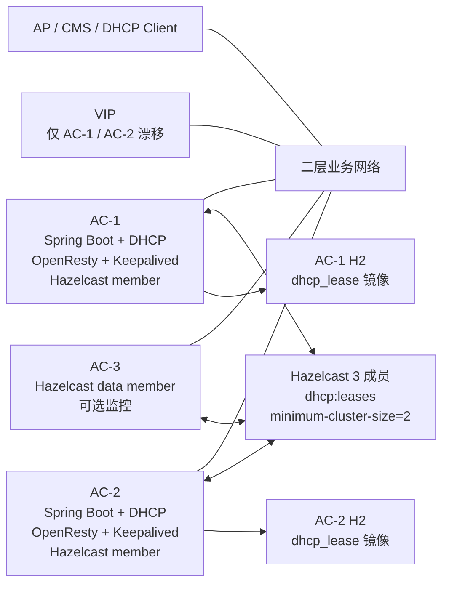

# AC 三节点 HA 与 DHCP 热备调研

## 1. 结论

两台机器做主备可以解决普通宕机切换，但无法彻底解决网络分区下的“双主”问题。第三台机器的价值不是再多跑一个 DHCP，而是引入多数派仲裁，让系统在不确定时停止分配新 IP，优先避免重复地址。

推荐第一阶段采用：

```text
AC-1：业务节点，Spring Boot + DHCP + OpenResty + Keepalived + Hazelcast
AC-2：业务节点，Spring Boot + DHCP + OpenResty + Keepalived + Hazelcast
AC-3：仲裁/见证节点，Hazelcast 数据成员，可选运行监控，不承载 VIP 和 DHCP
```

运行原则：

- VIP 只在 AC-1 和 AC-2 之间漂移。
- DHCP 只有当前 MASTER 响应。
- STANDBY 可以接收租约同步，但不发送 DHCPOFFER/DHCPACK。
- AC-3 参与 Hazelcast 集群、租约副本和多数派判断，防止 AC-1/AC-2 网络分区时两边都继续分配地址。
- Hazelcast `dhcp:leases` 是运行时权威租约状态，H2 是各节点本地持久化镜像。
- 任一节点不能确认自己持有 VIP、不能确认 Hazelcast 多数派、不能确认租约状态可信时，必须拒绝新 DHCP 分配。

如果现场要求第三台也能在 AC-1、AC-2 故障后直接接管业务，则采用增强方案：

```text
AC-1 / AC-2 / AC-3 都部署完整 AC 服务
Keepalived 三节点 VRRP，优先级 110 / 100 / 90
同一时刻仍只允许一个 MASTER 响应 DHCP
```

该方案是“三机一主两备”，可用性更高，但改造和运维复杂度更高。仍建议 DHCP 保持单主热备，不建议三台同时分配同一地址池。

## 2. 为什么三节点比双节点可靠

双节点主备最大风险是没有仲裁：

```text
AC-1 看不到 AC-2：AC-1 可能认为自己应继续服务
AC-2 看不到 AC-1：AC-2 也可能认为自己应接管
结果：两边都可能响应 DHCP，或都写本地租约，最终重复分配 IP
```

三节点可以用多数派规避：

```text
多数派 = 至少 2 个 Hazelcast 成员可见
AC-1 + AC-3：允许 AC-1 所在侧服务
AC-2 单独：禁止 AC-2 分配新 IP
AC-2 + AC-3：允许 AC-2 所在侧服务
AC-1 单独：禁止 AC-1 分配新 IP
```

这符合当前医疗内网场景的优先级：宁可短时间不能分配新 IP，也不能重复分配 IP。

## 3. 标准方案参考

调研到的主流 DHCP HA 思路是一致的：

- DHCP 热备通常是两个 active failover partner，一主一备或双活分担。Microsoft DHCP failover 明确一个 failover relationship 只能包含两个 DHCP 服务器；热备模式下 active 服务器负责地址分配，standby 只在 active 不可用时发放地址。
- ISC Kea HA 支持 `hot-standby`，正常情况下 primary 响应 DHCP，standby 接收租约更新但不响应请求，primary 故障后 standby 才接管。Kea 还支持 backup 角色，用于接收租约副本但不直接服务。
- VRRP/Keepalived 负责 VIP 漂移和选主。VRRP 语义是多个路由器中只有 Master 承担虚拟地址责任，Backup 监控 Master，Master 不可用后最高优先级 Backup 接管。
- Hazelcast 提供 split-brain protection，可设置最小集群成员数。成员数低于阈值时，对受保护数据结构的操作会被拒绝，适合保护 DHCP 租约 Map。

参考链接：

- [Microsoft DHCP failover](https://learn.microsoft.com/en-us/windows-server/networking/technologies/dhcp/dhcp-failover)
- [ISC Kea High Availability hook](https://kea.readthedocs.io/en/stable/arm/hooks.html)
- [VRRP RFC 5798](https://www.rfc-editor.org/rfc/rfc5798.html)
- [Keepalived manpage](https://www.keepalived.org/manpage.html)
- [Hazelcast split-brain protection](https://docs.hazelcast.com/hazelcast/5.6/network-partitioning/split-brain-protection)

## 4. 推荐架构：2 业务节点 + 1 仲裁节点



角色分工：

| 角色 | AC-1 | AC-2 | AC-3 |
|---|---:|---:|---:|
| HTTP/API 入口 | 是 | 是 | 否 |
| VIP 漂移 | 是 | 是 | 否 |
| DHCP 监听 | 是 | 是 | 否 |
| DHCP 响应 | 仅 MASTER | 仅 MASTER | 否 |
| 租约权威状态 | Hazelcast 成员 | Hazelcast 成员 | Hazelcast 成员 |
| H2 本地镜像 | 是 | 是 | 可选 |
| 仲裁投票 | 是 | 是 | 是 |

该方案能解决双节点最关键的问题：

- AC-1/AC-2 分区时，只有拿到 AC-3 的一侧具备多数派。
- 没有多数派的一侧即使错误持有 VIP，也不能响应 DHCP。
- STANDBY 接管前已有租约视图，不会从空内存重新分配地址池。

注意：如果 AC-3 只配置为 Hazelcast lite member，它可以参与集群成员关系，但不保存 `IMap` 分区。第一版建议 AC-3 作为数据成员运行，只关闭业务服务、VIP 和 DHCP，这样 `dhcp:leases` 的 `backup-count=2` 才能把租约副本放到另外两台成员上。

## 5. 增强架构：3 台都可接管

如果第三台机器也必须具备业务接管能力，可把 AC-3 也部署成完整业务节点：

```text
AC-1 priority 110
AC-2 priority 100
AC-3 priority 90
```

Keepalived 三台都配置同一个 `virtual_router_id` 和同一个 VIP，`unicast_peer` 包含另外两台机器。

示例：

```conf
vrrp_instance VI_AC {
    state BACKUP
    interface TODO_INTERFACE
    virtual_router_id 51
    priority 110
    advert_int 1
    nopreempt

    unicast_src_ip TODO_AC1_IP
    unicast_peer {
        TODO_AC2_IP
        TODO_AC3_IP
    }

    virtual_ipaddress {
        TODO_VIP_CIDR dev TODO_INTERFACE
    }

    track_script {
        chk_ac_app
    }

    notify_master "/etc/keepalived/notify.sh MASTER"
    notify_backup "/etc/keepalived/notify.sh BACKUP"
    notify_fault  "/etc/keepalived/notify.sh FAULT"
}
```

AC-2、AC-3 只需要调整 `router_id`、`priority`、`unicast_src_ip` 与 peer 列表。

注意：三台都可接管并不代表三台同时响应 DHCP。DHCP 仍应保持单主热备，否则要拆分地址池、实现更复杂的冲突处理和租约协调，不适合当前项目第一阶段。

## 6. DHCP 热备必须改的代码

### 6.1 HA 角色服务

新增应用内角色状态：

```text
UNKNOWN
MASTER
STANDBY
WITNESS
FAULT
MAINTENANCE
```

应用不能只信 Keepalived 通知。判断是否能服务 DHCP 时必须同时满足：

```text
本机角色是 MASTER
本机实际持有 VIP
Hazelcast 集群有多数派
dhcp:leases 可读写
本地租约镜像已加载完成
DHCP 没被人工禁用
```

建议提供接口：

```text
POST /internal/ha/role?role=MASTER|BACKUP|FAULT
GET  /actuator/health/ha
GET  /internal/ha/status
```

`notify.sh` 调用角色接口，`check_app.sh` 调用 HA 健康接口。

### 6.2 DHCP 响应闸门

在 DHCP 处理链路前后都检查角色：

```text
收到 DHCPDISCOVER/DHCPREQUEST
  -> canServeDhcp() 为 false：直接丢弃，不响应
  -> 分配或续租前：检查租约 Map 多数派
  -> 准备发送 DHCPOFFER/DHCPACK 前：再次检查 canServeDhcp()
```

需要覆盖：

- `DHCPOFFER`
- `DHCPACK`
- `DHCPNAK`
- `DHCPRELEASE`
- `DHCPDECLINE`
- 续租和重新绑定流程

### 6.3 Server Identifier 使用 VIP

DHCP Option 54 必须配置为 VIP。否则客户端续租可能直接找旧主物理 IP，主备切换后续租失败或绕开新主。

如果当前代码从第一块物理网卡自动取 Server IP，需要改为：

```text
优先使用配置项 dhcp.server-identifier
生产 HA 环境配置为 VIP
单机环境可配置为本机业务 IP
```

发送 DHCP 响应时也应尽量绑定 VIP 作为源地址。绑定失败时，应用必须确认当前是否真的持有 VIP，不能在 BACKUP 上继续发送。

### 6.4 租约权威状态

当前 `ConcurrentHashMap` 只能作为本地缓存，不能作为 HA 权威状态。

建议新增：

```text
DhcpLeaseService
DhcpLeaseRepository
DhcpLeaseEntity
HazelcastDhcpLeaseStore
```

分配流程：

```text
1. 根据 MAC / deviceId 查询已有租约
2. 没有租约时选择候选 IP
3. 对候选 IP 做 Hazelcast 原子占用
4. 占用成功后写本地 H2 镜像
5. 确认仍是 MASTER 且持有 VIP
6. 发送 DHCP 响应
```

Hazelcast 建议：

```text
dhcp:leases
  backup-count = 2
  split-brain-protection-ref = dhcp-majority

dhcp:lease-locks 或按 IP key 原子执行
  split-brain-protection-ref = dhcp-majority

dhcp-majority
  minimum-cluster-size = 2
```

### 6.5 H2 本地镜像

新增表 `dhcp_lease`：

| 字段 | 说明 |
|---|---|
| `ip_address` | 唯一 |
| `mac_address` | 唯一或按业务规则唯一 |
| `device_id` | 设备标识 |
| `lease_state` | OFFERED / ACTIVE / EXPIRED / RELEASED / DECLINED |
| `lease_start_time` | 租约开始 |
| `lease_expire_time` | 租约结束 |
| `last_seen_time` | 最近出现 |
| `owner_node_id` | 最后写入节点 |
| `ha_epoch` | 主节点任期，防旧主写入 |
| `version` | 乐观锁版本 |
| `created_at` / `updated_at` | 审计时间 |

启动恢复：

```text
节点启动
  -> 读取 H2 本地租约
  -> 加入 Hazelcast
  -> 如果 Hazelcast 为空且有多数派，按版本/过期时间合并
  -> 如果 Hazelcast 已有权威视图，以 Hazelcast 覆盖本地镜像
  -> 同步完成后才允许成为 VIP eligible
```

### 6.6 定时任务与广播/多播

所有对外有副作用的任务都应加同一个 HA 闸门：

```text
只有 MASTER 执行：
  DHCP 租约过期回收
  设备发现广播
  主动控制类广播/多播
  对 AP/CMS 的状态写入和指令下发

STANDBY 可执行：
  接收租约同步
  本地镜像更新
  健康检查
  只读监控
```

## 7. 分区与故障行为

| 场景 | 期望行为 |
|---|---|
| AC-1 宕机 | AC-2 与 AC-3 形成多数派，AC-2 接管 VIP 和 DHCP |
| AC-2 宕机 | AC-1 与 AC-3 保持多数派，AC-1 继续服务 |
| AC-3 宕机 | AC-1 与 AC-2 仍有 2 个成员，继续服务，但告警 |
| AC-1 与 AC-2 网络不通，AC-3 在 AC-2 侧 | AC-2 侧有多数派，AC-1 侧禁止 DHCP |
| AC-1 单独成孤岛但仍持有 VIP | HA 健康失败，释放 VIP；即使未释放，也不能响应 DHCP |
| Hazelcast 少于 2 成员 | 禁止新分配，可按策略允许续租已有本地租约，但不建议第一版开放 |
| 旧主恢复 | 先作为 STANDBY 同步租约，不抢占；同步完成后再具备接管资格 |

## 8. 落地阶段

### 第一阶段：证明三节点仲裁闭环

- 增加 AC-3 Hazelcast 数据成员部署，作为仲裁见证节点。
- Hazelcast 静态成员改为 3 个 IP。
- 为 DHCP 租约 Map 增加多数派保护。
- `check_app.sh` 改为必须检查 HA 健康接口。
- 抓包证明只有 MASTER 响应 DHCP。

### 第二阶段：完成 DHCP 热备代码

- HA 角色服务。
- DHCP 响应闸门。
- DHCP Option 54 改为 VIP。
- 租约写入 Hazelcast + H2。
- STANDBY 启动后同步租约并保持 ready 状态。

### 第三阶段：完善业务网络副作用控制

- 广播、多播、定时任务只允许 MASTER 执行。
- 新增 HA 状态页面或诊断接口。
- 增加切换、分区、旧主恢复自动化验证。

## 9. 给领导汇报的一句话

三台机器不是简单做“三个 DHCP”，而是做“两台业务热备 + 一台仲裁见证”。DHCP 必须保持单主响应，租约必须先进入三节点多数派保护的共享状态，再返回给客户端。这样可以解决双机方案最严重的双主和重复分配 IP 风险。
