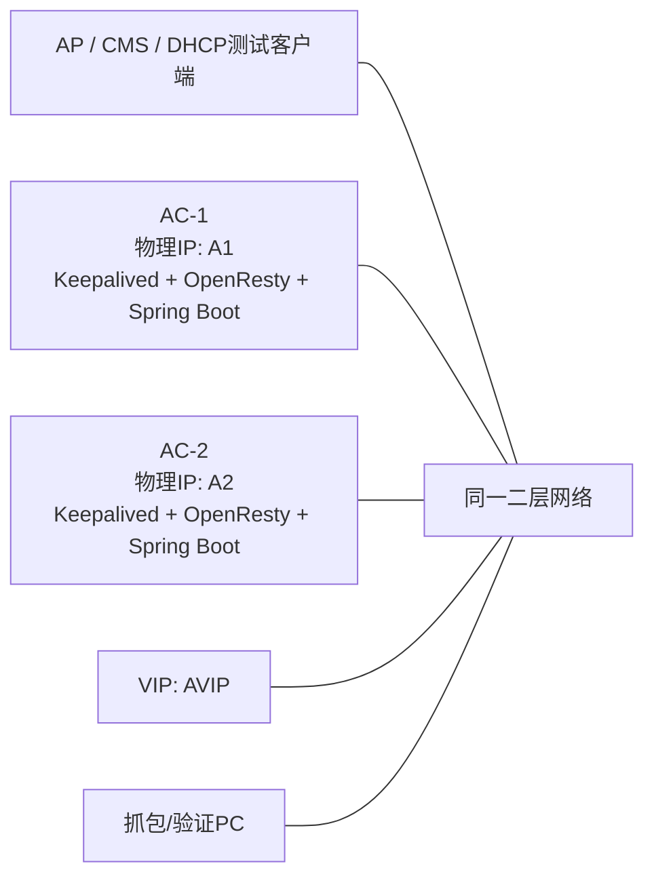
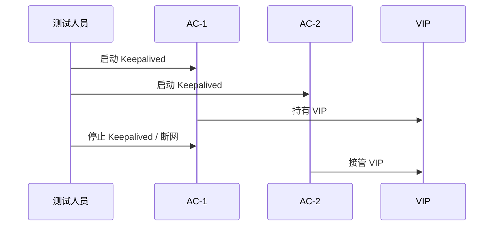
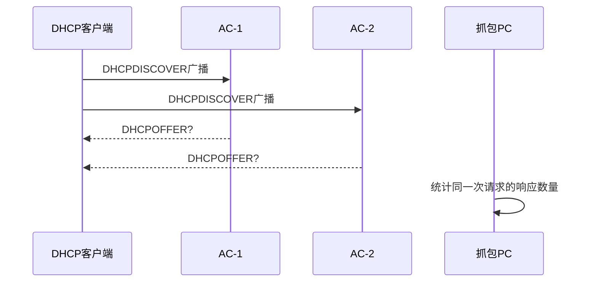
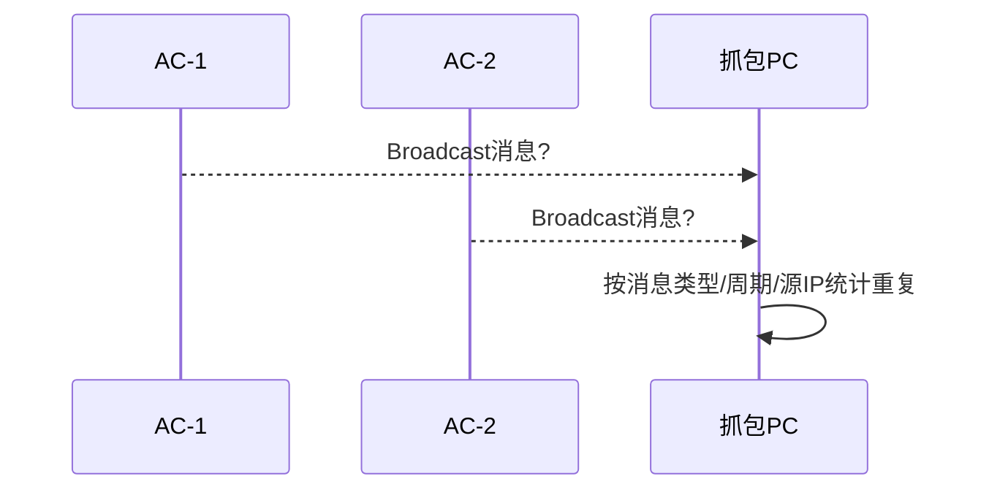

# AC 双机 HA 问题验证方案

## 1. 验证目标

本次验证不实施代码改造，只按当前双机主备部署验证是否存在 HA 风险。验证重点是用抓包、日志、数据库和接口行为证明问题是否真实存在。

需要覆盖的问题：

- 正常 HA 能力：VIP 是否能漂移，HTTP/API 是否能恢复访问。
- DHCP 问题：是否存在双响应、租约不一致、切换后重复分配、Server Identifier 错误。
- 双主问题：两台 AC 是否可能同时对外提供网络服务。
- 广播服务问题：主备同时运行时是否产生重复广播、重复处理或源地址异常。
- 多播服务问题：主备同时加入多播组后是否产生重复消息、重复处理或切换异常。

当前工作区没有项目源码，本方案以黑盒/灰盒验证为主。

## 2. 验证环境

### 2.1 推荐拓扑



### 2.2 前置条件

- AC-1、AC-2、AP/CMS、抓包 PC 在同一二层网段。
- AC-1、AC-2 都按当前项目正常部署 Spring Boot。
- Keepalived 按正常主备方式配置 VIP。
- OpenResty 部署在两台 AC 本机，HTTP/API 通过 VIP 访问。
- 不修改当前 DHCP、广播、多播业务代码。
- DHCP 地址池中排除 AC-1 物理 IP、AC-2 物理 IP、VIP、抓包 PC IP。

### 2.3 建议工具

| 工具 | 用途 |
|---|---|
| Wireshark / tcpdump | 抓 DHCP、广播、多播包 |
| curl | 验证 HTTP/API |
| ip addr / ipconfig | 确认 VIP 当前在哪台 AC 上 |
| journalctl / 应用日志 | 确认主备状态和应用处理行为 |
| H2 Console / 数据库查看工具 | 检查两台本地数据库是否漂移 |

### 2.4 建议记录信息

| 项目 | 示例 |
|---|---|
| AC-1 物理 IP | `192.168.1.10` |
| AC-2 物理 IP | `192.168.1.11` |
| VIP | `192.168.1.100` |
| 业务网卡 | `eth0` |
| Spring Boot 端口 | `8080` |
| DHCP 地址池 | `192.168.1.200-192.168.1.220` |
| 广播端口 | 以项目实际配置为准 |
| 多播地址和端口 | 以项目实际配置为准 |

## 3. 正常 HA 验证

### 3.1 VIP 漂移验证



### 3.2 验证项

| 编号 | 操作 | 期望 | 异常说明 |
|---|---|---|---|
| HA-01 | 两台 AC 同时启动 | 只有一台持有 VIP | 两台都持有 VIP 表示双主 |
| HA-02 | 停止 MASTER Keepalived | VIP 漂移到 BACKUP | 不漂移说明主备不可用 |
| HA-03 | 恢复旧 MASTER | VIP 不频繁来回漂移 | 来回漂移会影响 DHCP 和广播/多播稳定性 |
| HA-04 | 访问 VIP HTTP/API | 主备切换后能恢复 | 不能恢复说明 OpenResty 或应用健康检查有问题 |

### 3.3 建议命令

在 AC 上查看 VIP：

```bash
ip addr show
```

查看 Keepalived 状态：

```bash
systemctl status keepalived
journalctl -u keepalived -f
```

验证 VIP 连通性：

```bash
ping <VIP>
curl -i http://<VIP>:<HTTP_PORT>/
```

### 3.4 记录项

- 切换前后 `ip addr show` 输出。
- `ping VIP` 丢包时间。
- `curl http://VIP/...` 恢复时间。
- Keepalived 日志中的 MASTER/BACKUP 状态变化。

## 4. DHCP 问题验证

### 4.1 DHCP 双响应验证

目的：证明两台 AC 都能收到 DHCP 广播时，当前代码是否会同时响应。



操作：

1. 两台 Spring Boot 都启动。
2. 不手工停用 BACKUP 的 DHCP。
3. AP/CMS 或测试客户端发起 DHCP 申请。
4. 在抓包 PC 上过滤 DHCP 包。

Wireshark 过滤：

```text
udp.port == 67 or udp.port == 68
```

tcpdump 命令：

```bash
tcpdump -i <网卡> -nn -vvv -s 0 -w dhcp-double-response.pcap 'udp port 67 or udp port 68'
```

判定：

| 结果 | 结论 |
|---|---|
| 同一次 DHCPDISCOVER 只收到一个 DHCPOFFER | 当前没有双响应，继续验证是否只是偶然 |
| 同一次 DHCPDISCOVER 收到两个 DHCPOFFER | 存在 DHCP 双主响应问题 |
| DHCPOFFER 来源是物理 IP 而不是 VIP | Server Identifier 或响应源地址存在 HA 风险 |

重点查看：

- DHCP Transaction ID 是否相同。
- `DHCPOFFER` 数量。
- `DHCPACK` 数量。
- Option 54 Server Identifier。
- 源 MAC / 源 IP 是 AC-1、AC-2 还是 VIP。

### 4.2 DHCP 租约一致性验证

目的：证明租约只在本地内存时，主备切换后 BACKUP 是否不知道已有租约。

| 步骤 | 操作 |
|---|---|
| 1 | AC-1 作为 MASTER，AC-2 作为 BACKUP |
| 2 | 客户端 C1 申请 IP，记录 MAC、分配 IP、租期 |
| 3 | 不释放租约，停止 AC-1 Spring Boot 或断开 AC-1 网络 |
| 4 | AC-2 接管 VIP |
| 5 | 使用新客户端 C2 申请 IP |
| 6 | 对比 C2 是否拿到 C1 已占用 IP |

判定：

| 结果 | 结论 |
|---|---|
| C2 拿到 C1 的 IP | 租约一致性问题成立 |
| C2 没拿到 C1 的 IP | 继续检查是否 AC-2 实际同步了租约，或只是地址池足够大未触发 |
| AC-2 日志中没有 C1 租约 | 当前 BACKUP 没有完整租约视图 |

增强验证：

- 将 DHCP 地址池临时缩小到 2-3 个 IP，更容易暴露重复分配。
- 使用多个客户端并发申请。
- 重启两台 Spring Boot 后再次申请，确认本地内存租约是否丢失。

### 4.3 DHCP Server Identifier 验证

目的：确认 DHCP Option 54 是否使用 VIP。

操作：

1. 抓 `DHCPOFFER` 和 `DHCPACK`。
2. 查看 Option 54 `DHCP Server Identifier`。

判定：

| Option 54 | 结论 |
|---|---|
| VIP | 符合 HA 预期 |
| AC 物理 IP | 客户端续租可能绕过 VIP，切换后续租失败或找旧主 |
| 两台 AC 各自物理 IP | 双主和续租混乱风险同时存在 |

### 4.4 DHCP 切换验证

目的：验证切换过程中是否会丢租约、重复分配或长时间不可用。

操作：

1. C1 获取 IP。
2. C1 持续续租或重新 DHCP REQUEST。
3. 停止 MASTER Spring Boot。
4. BACKUP 接管后观察 C1 续租结果。

判定：

| 现象 | 问题 |
|---|---|
| C1 续租失败但稍后重新获取 IP | 可用性下降，但未必重复 |
| C1 被分配新 IP | 租约恢复能力不足 |
| C2 获取到 C1 原 IP | 重复分配，严重问题 |
| 抓包出现两个 DHCPACK | 双主响应，严重问题 |

## 5. 双主问题验证

### 5.1 Keepalived 双主验证

目的：确认网络抖动、VRRP 不通、健康检查异常时是否会出现两台同时持有 VIP。

| 编号 | 操作 | 观察 |
|---|---|---|
| SPLIT-01 | 阻断 AC-1 与 AC-2 之间 VRRP 通信 | 两台是否都成为 MASTER |
| SPLIT-02 | 阻断 Hazelcast 通信但保留业务网络 | DHCP 是否继续分配 |
| SPLIT-03 | MASTER 应用卡死但机器仍在线 | VIP 是否会漂移 |
| SPLIT-04 | BACKUP 应用异常但 Keepalived 正常 | BACKUP 是否仍可能接管 |

判定：

- 两台网卡同时出现 VIP：存在双主。
- 两台都发送 Gratuitous ARP：存在 VIP 抖动风险。
- 两台同时响应 DHCP/广播/多播：业务双主成立。
- Hazelcast 不通但 DHCP 继续分配：租约一致性风险成立。

### 5.2 应用层双主验证

即使 Keepalived 没双主，也要验证应用层是否双主。

观察项：

- BACKUP 是否仍启动 DHCP 监听。
- BACKUP 是否仍发送广播。
- BACKUP 是否仍加入多播组并处理业务。
- BACKUP 是否仍执行定时任务、设备发现、状态同步等对外动作。

判定原则：

```text
只要 BACKUP 对外发送业务控制类网络包，就存在应用层双主风险。
```

## 6. 广播服务 HA 验证

广播服务主要风险：两台 AC 同时广播、重复发现、重复控制、客户端看到两个 AC。

### 6.1 广播发送重复验证



操作：

1. 两台 AC 同时启动。
2. 抓包过滤广播地址，或按实际 UDP 端口过滤。

Wireshark 过滤：

```text
eth.dst == ff:ff:ff:ff:ff:ff
```

tcpdump 命令：

```bash
tcpdump -i <网卡> -nn -vvv -s 0 -w broadcast-ha.pcap 'broadcast'
```

观察：

- 同一周期是否有 AC-1、AC-2 各发一份相同广播。
- 广播源 IP 是物理 IP 还是 VIP。
- AP/CMS 是否收到两个 AC 的发现/心跳/控制消息。

判定：

| 现象 | 问题 |
|---|---|
| 两台都发相同广播 | 广播双主 |
| 源 IP 是物理 IP | 客户端可能绑定到物理 AC，绕过 VIP |
| 切换后旧主仍发广播 | 旧主未降级 |
| 广播频率翻倍 | 可能造成发现状态抖动或网络噪声 |

### 6.2 广播接收重复处理验证

操作：

1. 使用 AP/CMS 或测试工具发送一条广播请求。
2. 查看两台 AC 日志和数据库。

判定：

| 现象 | 问题 |
|---|---|
| 两台 AC 都处理同一广播请求并写状态 | 应用层双主 |
| 两台 AC 都回应客户端 | 客户端可能选择错误 AC |
| BACKUP 写入本地 H2 | 配置/设备状态漂移风险 |

### 6.3 广播切换验证

操作：

1. MASTER 正常发送广播。
2. 停止 MASTER 或断网。
3. BACKUP 接管。
4. 观察广播恢复时间和源地址。

期望：

- 切换前只有 MASTER 发广播。
- 切换后只有新 MASTER 发广播。
- 源地址应尽量体现 VIP 或协议内携带 VIP。

## 7. 多播服务 HA 验证

多播服务主要风险：两台 AC 同时加入多播组、同时发送多播、同时消费多播消息，导致重复处理。

### 7.1 多播组成员验证

操作：

1. 两台 AC 启动后查看多播组成员。
2. 确认 BACKUP 是否加入同一多播组并处理业务。

Linux 命令：

```bash
ip maddr show
netstat -g
```

观察：

- AC-1 是否加入多播组。
- AC-2 是否也加入同一多播组。
- BACKUP 是否仍在消费业务多播。

判定：

| 现象 | 问题 |
|---|---|
| 两台都加入且都处理业务 | 多播应用层双主 |
| BACKUP 只监听但不处理 | 可接受，需确认不会回包 |
| 切换后旧主仍处理 | 降级不完整 |

### 7.2 多播发送重复验证

Wireshark 过滤：

```text
ip.dst >= 224.0.0.0 and ip.dst <= 239.255.255.255
```

tcpdump 命令：

```bash
tcpdump -i <网卡> -nn -vvv -s 0 -w multicast-ha.pcap 'multicast'
```

观察：

- 同一业务周期是否由 AC-1、AC-2 同时发多播。
- 多播源 IP 是物理 IP 还是 VIP。
- AP/CMS 是否收到重复消息。

判定：

| 现象 | 问题 |
|---|---|
| 两台同时发送相同多播 | 多播双主 |
| 源 IP 是物理 IP | 客户端可能记住旧主，切换后异常 |
| 切换后新主不发 | 多播服务未随 HA 接管 |
| 旧主恢复后也发 | 旧主抢业务或未降级 |

### 7.3 多播接收重复处理验证

操作：

1. 让 AP/CMS 或测试工具发送一条多播业务消息。
2. 查看两台 AC 日志、状态和数据库。

判定：

| 现象 | 问题 |
|---|---|
| 两台都处理并产生业务状态变化 | 多播重复消费 |
| 两台都回包 | 客户端可能收到两个响应 |
| BACKUP 写本地状态 | 主备数据漂移 |

## 8. 结果记录模板

每个问题建议按下面格式记录，方便给领导汇报：

| 字段 | 内容 |
|---|---|
| 问题编号 | DHCP-01 / SPLIT-01 / BCAST-01 / MCAST-01 |
| 问题名称 | 例如：BACKUP 节点仍响应 DHCP |
| 验证环境 | AC-1、AC-2 IP、VIP、版本、配置 |
| 触发步骤 | 简要步骤 |
| 预期结果 | HA 下应该只有 MASTER 响应 |
| 实际结果 | 抓包、日志、数据库证据 |
| 影响 | 重复 IP、设备绑定旧主、状态漂移等 |
| 严重级别 | 高 / 中 / 低 |
| 证据附件 | pcap、日志片段、截图 |

## 9. 优先级

建议按下面顺序验证：

1. VIP 漂移和 HTTP/API 恢复。
2. DHCP 双响应。
3. DHCP 租约一致性和重复分配。
4. DHCP Option 54 是否为 VIP。
5. 应用层双主：BACKUP 是否仍执行 DHCP、广播、多播。
6. 广播重复发送和重复处理。
7. 多播重复发送和重复处理。
8. Hazelcast 断开、VRRP 阻断、旧主恢复等异常场景。

## 10. 预期能证明的问题

如果当前代码确实符合以下现状：

- DHCP 自动启动。
- 租约只在本地 `ConcurrentHashMap`。
- 广播/多播服务不受 HA 角色控制。

则本轮验证大概率能证明：

- 两台 AC 都运行时，BACKUP 仍可能对外处理网络服务。
- DHCP 存在双响应风险。
- 主备切换后，BACKUP 缺少 MASTER 已分配租约，存在重复分配风险。
- DHCP Server Identifier 如果使用物理 IP，会导致客户端续租绕过 VIP。
- 广播服务可能重复发送或重复处理。
- 多播服务可能重复发送、重复消费或源地址不符合 HA 预期。
- H2 双本地文件在无同步机制下可能出现状态漂移。
